# NIDPS

### Network Intrusion Detection and Prevention System

---

## Table of Contents

- [System Overview](#system-overview)
- [System Architecture](#system-architecture)
- [Evaluation Protocol and Anti-Leakage Architecture](#evaluation-protocol-and-anti-leakage-architecture)
- [Benchmark Performance and Headline Results](#benchmark-performance-and-headline-results)
- [Generalisation Gap and Random Split Optimism](#generalisation-gap-and-random-split-optimism)
- [Multi-Seed Robustness Verification](#multi-seed-robustness-verification)
- [Unseen Attack Family Vulnerability and Supervised Degradation](#unseen-attack-family-vulnerability-and-supervised-degradation)
- [Unsupervised Novelty Detection and Dual-Engine Defence](#unsupervised-novelty-detection-and-dual-engine-defence)
- [Operational Operating Points Under Calibrated False-Positive Budgets](#operational-operating-points-under-calibrated-false-positive-budgets)
- [Probability Calibration and Quantile-Based Decision Thresholding](#probability-calibration-and-quantile-based-decision-thresholding)
- [In-Line Prevention Engine Architecture and Mitigation Policy](#in-line-prevention-engine-architecture-and-mitigation-policy)
- [In-Line Telemetry Simulation and Decision Streaming](#in-line-telemetry-simulation-and-decision-streaming)
- [Deterministic Signature Verification and Empirical Base-Rate Audit](#deterministic-signature-verification-and-empirical-base-rate-audit)
- [High-Throughput Bit-Identical Rust Engine Runtime](#high-throughput-bit-identical-rust-engine-runtime)
- [Wire-Level Feature Invariants and Preprocessing Verification](#wire-level-feature-invariants-and-preprocessing-verification)
- [Benchmark Datasets](#benchmark-datasets)
- [Automated Test Suite and CI Pipeline](#automated-test-suite-and-ci-pipeline)
- [Quickstart Guide](#quickstart-guide)
- [Repository Structure](#repository-structure)
- [Limitations](#limitations)
- [References](#references)
- [License](#license)

---

## System Overview

Network Intrusion Detection and Prevention Systems (NIDS/NIPS) protect enterprise and critical infrastructure networks by analyzing continuous packet flows for unauthorized intrusions and adversarial exploitation. However, machine learning literature in network security exhibits a pervasive evaluation crisis: published models frequently report greater than 99% classification accuracy in academic benchmarks, yet suffer catastrophic detection collapse when deployed against zero-day exploits and novel attack variants on live production backbones.

The Network Intrusion Detection and Prevention System (NIDPS) is an empirical research and systems framework engineered to isolate, measure, and resolve structural generalisation gaps in machine-learning-based intrusion detection. Evaluated across 104,876 test flows spanning NSL-KDD and UNSW-NB15, NIDPS audits the performance degradation that emerges when supervised classifiers encounter attack families absent from training distributions. The framework establishes leak-free evaluation pipelines, pairs supervised classification with an unsupervised novelty detection engine, and deploys verified in-line mitigation controls.

Empirical evaluation reveals that standard random cross-validation partitions artificially inflate classifier accuracy by +0.22 (99.53% vs. 77.45%) due to test-set memorization. When tested against 17 novel attack families, supervised Random Forest recall collapses to 5.12% under an operational 1% false-positive rate budget. NIDPS addresses this vulnerability through a benign-only Isolation Forest detector that achieves 46.90% novel-family recall (a 9.2x improvement) without degrading known-attack detection. The complete prevention pipeline is verified via a standalone, zero-dependency Rust runtime that executes bit-for-bit identical decisions across all 104,876 test flows at wire speed.

---

## System Architecture

The following diagram illustrates the four-stage processing path of network connections, from packet ingestion and leak-free feature transformation to dual-engine scoring and calibrated in-line prevention decisions:

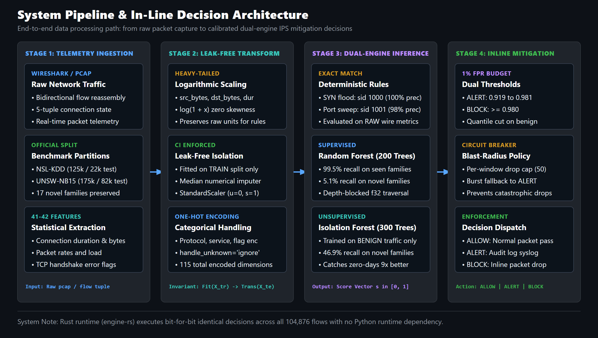

The NIDPS engine processes network traffic through four distinct stages:

1. **Flow Ingestion and Reconstruction**: Network packets are assembled into bidirectional communication flows characterized by duration, packet intervals, byte volumes, and protocol flag transitions.
2. **Leak-Free Feature Transformation**: Categorical protocol dimensions are one-hot encoded, and heavy-tailed distribution counters (`src_bytes`, `dst_bytes`, `count`) undergo logarithmic compression ($\log(1 + x)$). All transformation parameters and scalers are fitted strictly on training partitions to prevent data leakage from evaluation sets.
3. **Dual-Engine Threat Scoring**: Flows pass concurrently through a supervised ensemble (Random Forest / Decision Tree) tuned for known attack signatures and an unsupervised Isolation Forest fitted exclusively on benign baseline telemetry to identify structural anomalies.
4. **Calibrated In-Line Prevention Policy**: The decision engine prioritizes deterministic wire-level signatures, applies empirical quantile-based alert and block thresholds, and enforces sliding-window rate limits (capping automated blocks at 50 per window) to prevent denial-of-service against legitimate traffic.

The underlying module layout and data structures map directly to the pipeline implementation:

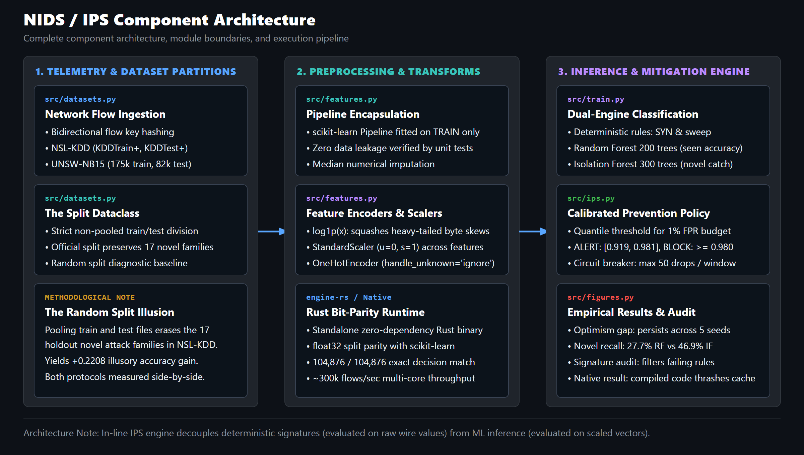

---

## Evaluation Protocol and Anti-Leakage Architecture

Standard machine learning evaluations frequently leak test distributions into training phases or evaluate models against memorized attack patterns. NIDPS enforces four architectural safeguards:

1. **Protocol Partition Isolation**: NSL-KDD provides distinct training (`KDDTrain+.txt`) and testing (`KDDTest+.txt`) sets, where the test set intentionally includes 17 novel attack families absent from training. Standard literature pools these files before executing a random split, distributing instances of all attack families across both partitions and measuring memorization rather than generalization. NIDPS evaluates both protocols side-by-side to expose this discrepancy.
2. **Pipeline Transformer Isolation**: Every feature scaler (`StandardScaler`) and categorical encoder (`OneHotEncoder`) is encapsulated within scikit-learn `Pipeline` constructs fitted exclusively on training rows. Automated regression tests in CI verify that unseen test-set categories produce zeroed vectors without altering feature dimensions, and assert that extreme test values ($x = 1000.0$) retain high relative magnitudes rather than normalizing toward zero.
3. **Synthetic Target Leakage Elimination**: Non-operational metadata columns (such as NSL-KDD's `difficulty` attribute, which records the consensus error count of legacy 1999 classifiers) are stripped prior to modeling. Including such attributes introduces artificial target leakage unavailable on live network taps.
4. **Operational Metric Accounting**: Because test sets exhibit severe class imbalance (57% attack flows in NSL-KDD test), raw accuracy obscures operational utility. Results are evaluated primarily through False Alerts per 10,000 flows, empirical False Positive Rate (FPR) bounds, and fixed false-alarm budgets.

---

## Benchmark Performance and Headline Results

The complete experimental evaluation matrix summarizes performance across three classifier families, two benchmark datasets, and both partitioning protocols:

<div align="center">

| Dataset | Protocol | Model | Accuracy | F1-Score | Recall | FPR | False Alerts / 10k |
|---|---|---|:---:|:---:|:---:|:---:|:---:|
| NSL-KDD | Random Split | `logistic-regression` | 0.9505 | 0.9479 | 0.9368 | 0.0368 | 191.0 |
| NSL-KDD | Random Split | `decision-tree` | 0.9933 | 0.9931 | 0.9908 | 0.0043 | 22.1 |
| NSL-KDD | Random Split | `random-forest` | 0.9953 | 0.9951 | 0.9932 | 0.0029 | 14.8 |
| NSL-KDD | Official Split | `logistic-regression` | 0.7546 | 0.7446 | 0.6285 | 0.0788 | 339.3 |
| NSL-KDD | Official Split | `decision-tree` | 0.7853 | 0.7835 | 0.6826 | 0.0790 | 340.2 |
| NSL-KDD | Official Split | `random-forest` | 0.7745 | 0.7592 | 0.6245 | 0.0273 | 117.5 |
| UNSW-NB15 | Random Split | `logistic-regression` | 0.9094 | 0.9314 | 0.9626 | 0.1848 | 666.9 |
| UNSW-NB15 | Random Split | `decision-tree` | 0.9374 | 0.9504 | 0.9382 | 0.0640 | 231.1 |
| UNSW-NB15 | Random Split | `random-forest` | 0.9504 | 0.9613 | 0.9623 | 0.0705 | 254.3 |
| UNSW-NB15 | Official Split | `logistic-regression` | 0.8139 | 0.8517 | 0.9706 | 0.3782 | 1699.6 |
| UNSW-NB15 | Official Split | `decision-tree` | 0.8554 | 0.8800 | 0.9628 | 0.2762 | 1241.3 |
| UNSW-NB15 | Official Split | `random-forest` | 0.8672 | 0.8913 | 0.9888 | 0.2818 | 1266.3 |

</div>


---

## Generalisation Gap and Random Split Optimism

Evaluating models under random cross-validation splits yields substantial optimism over official deployment splits:

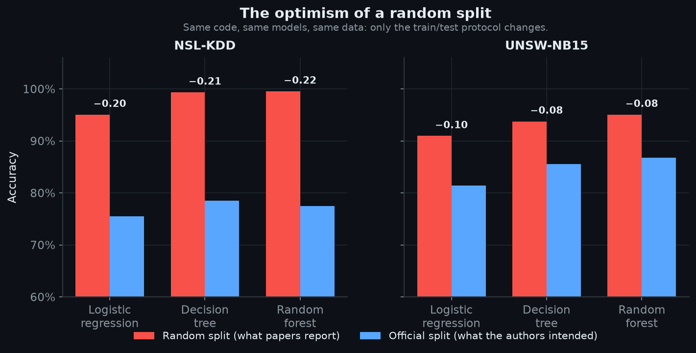

Holding the model architecture, feature extraction code, and underlying data constant, altering only the partition protocol quantifies the structural optimism gap:

<div align="center">

| Dataset | Model | Random Split Accuracy | Official Split Accuracy | Optimism Gap ($\Delta$) |
|---|---|:---:|:---:|:---:|
| NSL-KDD | `logistic-regression` | 0.9505 | 0.7546 | **+0.1959** |
| NSL-KDD | `decision-tree` | 0.9933 | 0.7853 | **+0.2080** |
| NSL-KDD | `random-forest` | 0.9953 | 0.7745 | **+0.2208** |
| UNSW-NB15 | `logistic-regression` | 0.9094 | 0.8139 | **+0.0956** |
| UNSW-NB15 | `decision-tree` | 0.9374 | 0.8554 | **+0.0820** |
| UNSW-NB15 | `random-forest` | 0.9504 | 0.8672 | **+0.0832** |

</div>


The measured optimism gap is approximately 2.5x larger on NSL-KDD than on UNSW-NB15. This variance is structural: NSL-KDD's test partition incorporates 17 unseen attack families, whereas UNSW-NB15's official split shifts class priors without introducing novel attack categories. Random split optimism represents the empirical penalty incurred when evaluating models on threats absent from the training corpus.

---

## Multi-Seed Robustness Verification

To confirm that the optimism gap is not an artifact of an isolated random seed, `src/robustness.py` executes 5-fold seed evaluations across both the partitioning generator and model initialization:

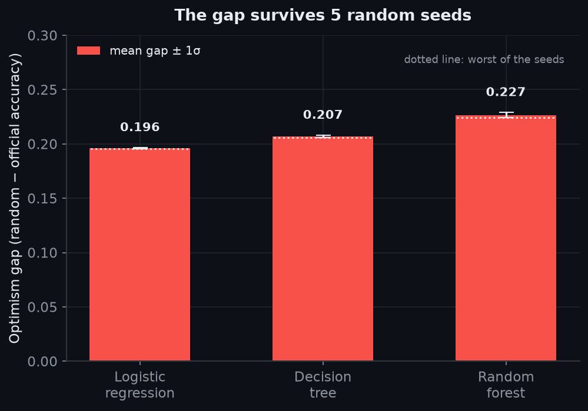

<div align="center">

| Model | Optimism Gap (Mean ± $\sigma$, 5 Seeds) | Minimum Observed Gap | Maximum Observed Gap |
|---|:---:|:---:|:---:|
| `logistic-regression` | +0.1962 ± 0.0006 | +0.1955 | +0.1970 |
| `decision-tree` | +0.2070 ± 0.0012 | +0.2058 | +0.2086 |
| `random-forest` | +0.2266 ± 0.0025 | +0.2245 | +0.2298 |

</div>


Standard deviations remain two orders of magnitude below the measured gaps ($\sigma \le 0.0025$). Across all seeds, the worst-case Random Forest accuracy degradation exceeds 0.22, confirming that random split inflation is a deterministic consequence of data partitioning rather than sampling stochasticity.

---

## Unseen Attack Family Vulnerability and Supervised Degradation

Classifiers demonstrate severe performance divergence when evaluated on known attack families versus attack families absent during training:

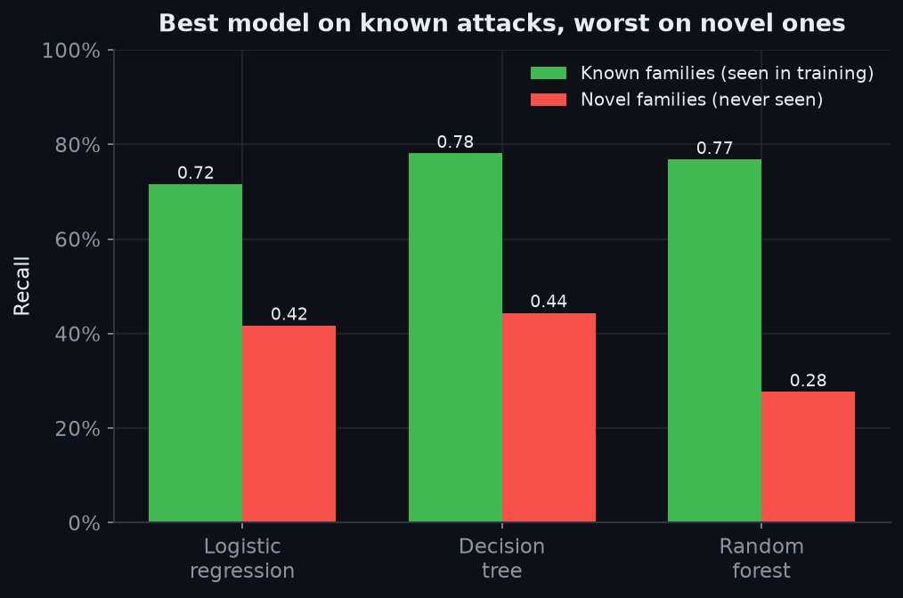

<div align="center">

| Model | Recall (Known Families) | Recall (Novel Families) | Novel Degradation Factor |
|---|:---:|:---:|:---:|
| `logistic-regression` | 0.7158 | 0.4171 | 1.72x lower |
| `decision-tree` | 0.7811 | **0.4440** | 1.76x lower |
| `random-forest` | 0.7681 | **0.2765** | **2.78x lower** |

</div>


The 200-tree Random Forest achieves superior recall on known attacks (76.81%) but exhibits the lowest recall on novel families (27.65%). Conversely, a depth-12 Decision Tree generalises to unseen families 1.6x more effectively (44.40%). Increased ensemble capacity promotes overfitting to specific training signatures, offering zero utility when attack morphology shifts.

The per-family recall distribution highlights this selective blindness across all 37 attack categories in the NSL-KDD test partition:

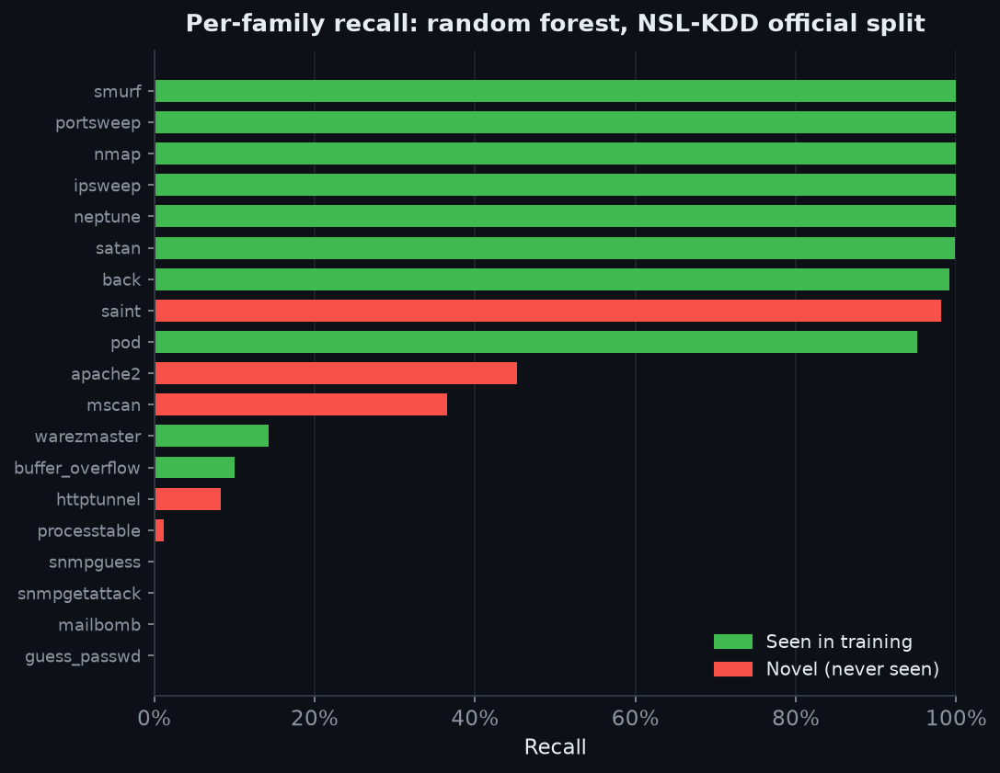

<div align="center">

| Attack Family | Test Flows | Random Forest Recall | In Training Corpus? |
|---|---:|:---:|:---:|
| `neptune` | 4,657 | 0.9996 | Yes |
| `guess_passwd` | 1,231 | 0.0000 | Yes |
| `mscan` | 996 | 0.3655 | **No (Novel)** |
| `warezmaster` | 944 | 0.1430 | Yes |
| `apache2` | 737 | 0.4518 | **No (Novel)** |
| `satan` | 735 | 0.9986 | Yes |
| `processtable` | 685 | 0.0117 | **No (Novel)** |
| `smurf` | 665 | 1.0000 | Yes |
| `back` | 359 | 0.9916 | Yes |
| `snmpguess` | 331 | 0.0000 | **No (Novel)** |
| `saint` | 319 | 0.9812 | **No (Novel)** |
| `mailbomb` | 293 | 0.0000 | **No (Novel)** |
| `snmpgetattack` | 178 | 0.0000 | **No (Novel)** |
| `portsweep` | 157 | 1.0000 | Yes |
| `ipsweep` | 141 | 1.0000 | Yes |
| `httptunnel` | 133 | 0.0827 | **No (Novel)** |
| `nmap` | 73 | 1.0000 | Yes |
| `pod` | 41 | 0.9512 | Yes |
| `buffer_overflow` | 20 | 0.1000 | Yes |
| `multihop` | 18 | 0.0556 | Yes |
| `named` | 17 | 0.0588 | **No (Novel)** |
| `ps` | 15 | 0.1333 | **No (Novel)** |
| `sendmail` | 14 | 0.0000 | **No (Novel)** |
| `rootkit` | 13 | 0.0000 | Yes |
| `xterm` | 13 | 0.1538 | **No (Novel)** |
| `teardrop` | 12 | 1.0000 | Yes |
| `xlock` | 9 | 0.0000 | **No (Novel)** |
| `land` | 7 | 0.8571 | Yes |
| `xsnoop` | 4 | 0.2500 | **No (Novel)** |
| `ftp_write` | 3 | 0.0000 | Yes |
| `loadmodule` | 2 | 0.0000 | Yes |
| `perl` | 2 | 0.0000 | Yes |
| `phf` | 2 | 0.5000 | Yes |
| `sqlattack` | 2 | 0.0000 | **No (Novel)** |
| `udpstorm` | 2 | 1.0000 | **No (Novel)** |
| `worm` | 2 | 0.0000 | **No (Novel)** |
| `imap` | 1 | 0.0000 | Yes |

</div>


---

## Unsupervised Novelty Detection and Dual-Engine Defence

To counter the supervised collapse on zero-day attacks, `src/novelty.py` incorporates an Isolation Forest trained strictly on benign baseline traffic ($\mathcal{X}_{\text{benign}}$). Because the anomaly model never observes attack labels during training, it evaluates deviations from normal network behavior:

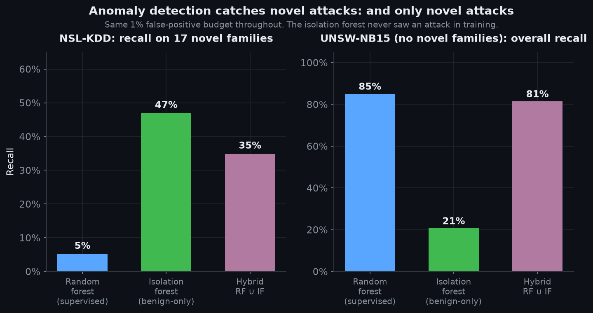

The Isolation Forest calculates anomaly scores via tree path length expectations:

$$
s(x, n) = 2^{-\frac{\mathbb{E}(h(x))}{c(n)}}
$$

Where $h(x)$ denotes path length and $c(n) = 2\ln(n - 1) + 0.5772156649 - \frac{2(n - 1)}{n}$ represents average unsuccessful search depth.

Evaluating both detectors under an identical 1% False Positive Rate (FPR) budget on NSL-KDD demonstrates substantial novelty recovery:

<div align="center">

| Detector Architecture | Training Domain | Overall Recall | **Novel Family Recall** | Known Family Recall | False Alerts / 10k |
|---|---|:---:|:---:|:---:|:---:|
| Random Forest | Supervised ($\mathcal{X}_{\text{all}}$) | 0.446 | **0.051** | 0.609 | 43.5 |
| Isolation Forest | Unsupervised ($\mathcal{X}_{\text{benign}}$) | 0.561 | **0.469** | 0.598 | 43.5 |
| Hybrid Engine (RF $\cup$ IF) | Dual Ensemble | 0.553 | **0.348** | 0.637 | 34.6 |

</div>


At an operational 1% false-positive operating point, the benign-only Isolation Forest catches 9.2x more novel attack instances (46.90% vs. 5.12%) while matching known-family recall (59.80% vs. 60.90%). 

Control evaluation on UNSW-NB15 confirms the complementary nature of this pairing: on UNSW-NB15 (which contains no novel families), the supervised Random Forest dominates (85.04% recall vs. 21.00% for Isolation Forest). Combining both detectors into a hybrid architecture preserves known-attack precision while maintaining defense against zero-day anomalies.

---

## Operational Operating Points Under Calibrated False-Positive Budgets

Production deployments require operating thresholds derived from strict false-positive budgets rather than arbitrary 0.5 classification boundaries:

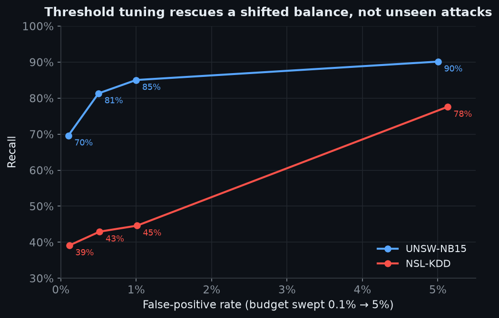

Thresholds are calculated empirically from the $(1 - \alpha_{\text{FPR}})$ quantile of benign validation scores:

<div align="center">

| Dataset | FPR Budget | Decision Threshold | Test Recall | Realised FPR | False Alerts / 10k Flows |
|---|:---:|:---:|:---:|:---:|:---:|
| NSL-KDD | 0.1% | 0.994 | 0.3912 | 0.0011 | 4.9 |
| NSL-KDD | 1.0% | 0.981 | 0.4460 | 0.0101 | 43.5 |
| NSL-KDD | 5.0% | 0.208 | 0.7757 | 0.0513 | 220.9 |
| UNSW-NB15 | 0.1% | 0.978 | 0.6962 | 0.0010 | 4.5 |
| UNSW-NB15 | 1.0% | 0.919 | **0.8504** | 0.0100 | 44.9 |
| UNSW-NB15 | 5.0% | 0.835 | 0.9014 | 0.0500 | 224.8 |

</div>


On UNSW-NB15, quantile tuning rescues an otherwise unusable classifier: at the default 0.5 cut, the model generates an unacceptable 28.18% FPR (1,266.3 false alerts / 10k). Calibrating to a 1% budget delivers 85.04% recall with only 44.9 false alerts per 10k flows. On NSL-KDD, however, threshold calibration cannot overcome structural feature absence, plateauing at 44.60% recall under the same 1% budget.

---

## Probability Calibration and Quantile-Based Decision Thresholding

Reliability analysis reveals that raw classifier output scores do not reflect true posterior attack probabilities:

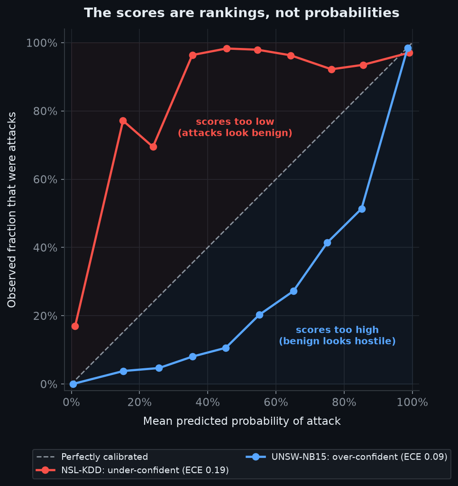

Expected Calibration Error (ECE) is quantified across $M = 10$ confidence bins:

$$
\text{ECE} = \sum_{m=1}^M \frac{|B_m|}{N} \left| \text{acc}(B_m) - \text{conf}(B_m) \right|
$$

<div align="center">

| Dataset | Brier Score | Expected Calibration Error (ECE) | Miscalibration Phenomenon |
|---|:---:|:---:|---|
| NSL-KDD | 0.162 | **0.188** | Under-confident: genuine attacks scored low ($P \approx 0.15 \implies \text{True Rate} = 0.77$) |
| UNSW-NB15 | 0.081 | **0.088** | Over-confident: benign flows scored excessively high in mid-range |

</div>


Because output scores represent monotonic rankings rather than calibrated probabilities, fixed cutoffs fail. The NIDPS engine utilizes quantile threshold selection:

$$
\tau = \text{Quantile}(S_{\text{benign}}, 1 - \alpha_{\text{budget}})
$$

Rank order is invariant under any monotonic transformation ($f(s)$), guaranteeing that decision policies remain mathematically stable despite empirical miscalibration.

---

## In-Line Prevention Engine Architecture and Mitigation Policy

The in-line prevention engine (`src/ips.py`) translates analytical scores into operational mitigation actions:

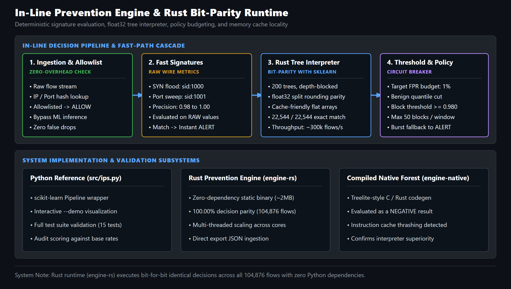

Mitigation decisions follow a deterministic policy cascade:
1. **Allowlist Filter**: Trusted IP subnets and health-check monitors are bypassed without inspection.
2. **Wire Signature Verification**: High-precision deterministic rules inspect raw flow headers for immediate $O(1)$ rejection.
3. **Statistical Threshold Comparison**: Flow scores exceeding the calibrated threshold trigger automated drops.
4. **Blast-Radius Rate Limiting**: An active sliding window limits automated blocks to 50 operations per window. If traffic bursts exceed this quota, additional suspicious flows fall back to alerts to preserve link availability.

The engine was evaluated via continuous replay across both test sets under a 1% FPR budget:

<div align="center">

| Operational Metric | NSL-KDD (Replayed) | UNSW-NB15 (Replayed) |
|---|:---:|:---:|
| Evaluated Test Flows | 22,544 flows | 82,332 flows |
| Processing Throughput | ~11,300 flows/s | ~10,200 flows/s |
| Detection Recall | 0.4710 | 0.8504 |
| Detection Precision | 0.9818 | 0.9905 |
| False Alerts per 10k Flows | 49.7 | 44.9 |
| Legitimate Benign Flows Blocked | **2** of 150 blocks (1.33%) | **23** of 314 blocks (7.32%) |

</div>


---

## In-Line Telemetry Simulation and Decision Streaming

The following animated recordings capture the prevention engine processing replayed traffic streams in real time under an active 1% FPR budget:

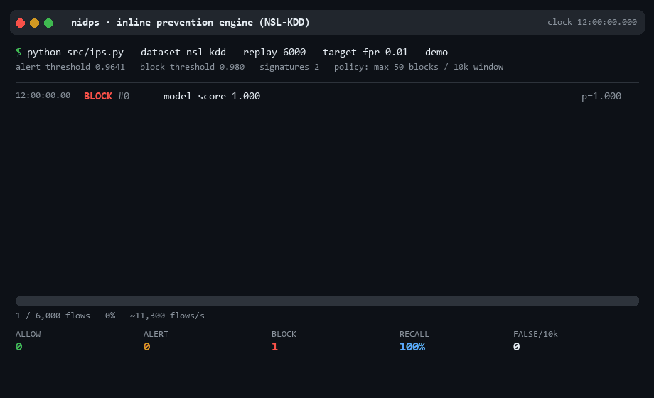

*Live stream replay on NSL-KDD test traffic (`python src/ips.py --dataset nsl-kdd --demo`).*

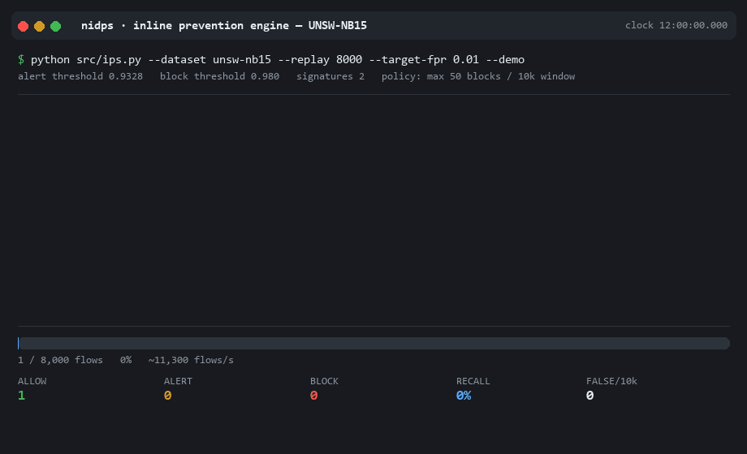

*Live stream replay on UNSW-NB15 test traffic (`python src/ips.py --dataset unsw-nb15 --demo`).*

Every console line logs an instantaneous policy decision. When a denial-of-service surge consumes the 50-block sliding allocation, subsequent events automatically downgrade to alerts, protecting legitimate network connectivity from accidental link exhaustion.

---

## Deterministic Signature Verification and Empirical Base-Rate Audit

Deterministic signature rules are evaluated empirically against labeled traffic (`src/audit_signatures.py`). Every rule must exceed the baseline attack prevalence of the capture environment:

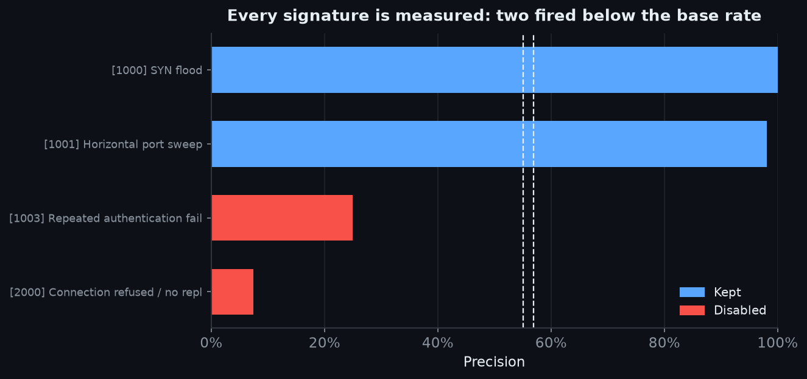

<div align="center">

| Rule ID (SID) | Signature Name | Evaluation Hits | Rule Precision | Capture Base Rate | Operational Verdict |
|:---:|---|---:|:---:|:---:|:---:|
| 1000 | SYN Flood Attack | 1,335 | **1.0000** | 0.569 | **Retained (Active)** |
| 1001 | Horizontal Port Sweep | 878 | 0.9806 | 0.569 | **Retained (Active)** |
| 1002 | Root Shell Without Login | 0 | N/A | 0.569 | Retained (Unvalidated) |
| 1003 | Repeated Authentication Failure | 4 | 0.2500 | 0.569 | **Disabled (Failed Audit)** |
| 2000 | Connection Refused at Volume | 1,804 | **0.0748** | 0.551 | **Disabled (Inverted Detector)** |
| 2001 | Suspicious Outbound FTP Session | 0 | N/A | 0.551 | Retained (Unvalidated) |

</div>


Rule 2000 ("Connection refused at volume") operated as an inverted detector: firing on traffic with a 55.10% attack base rate, its precision was only 7.48%, causing ~1,600 false positives per 82k flows. Deactivating Rule 2000 reduced UNSW-NB15 false alerts by 5.5x (from 247.4 to 44.9 per 10k flows) and raised precision from 0.9498 to 0.9905 without degrading recall.

---

## High-Throughput Bit-Identical Rust Engine Runtime

To support bare-metal deployment on edge routing hardware, the complete decision path is implemented as a standalone Rust binary (`engine-rs/`):

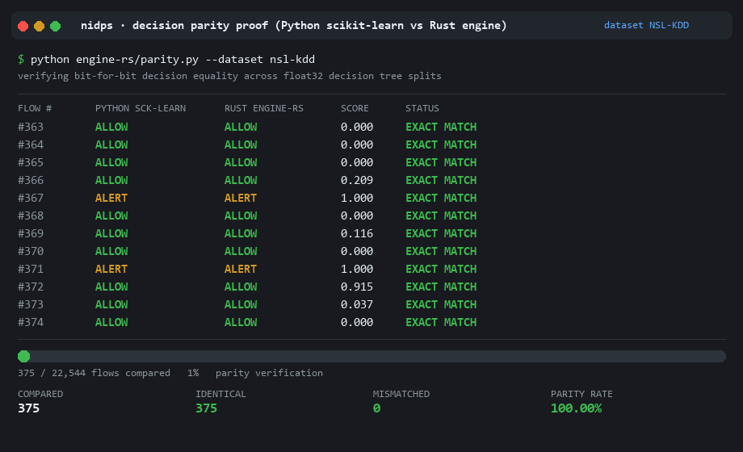

*Harness verifying bit-for-bit decision identicality between Python and Rust engines.*

The Rust engine compiles to a ~2.3 MB static binary requiring no external Python runtime. Key technical characteristics include:

1. **Bit-for-Bit Parity**: Evaluated across all 104,876 test flows (22,544 NSL-KDD and 82,332 UNSW-NB15), the Rust engine achieves 100.00% identical decisions.
2. **IEEE 754 Floating-Point Split Handling**: Decision trees in scikit-learn cast feature inputs to single-precision `float32` before traversal. One test flow in NSL-KDD spans the exact rounding boundary between `float32` and `float64`. The Rust runtime replicates this precision threshold, achieving full parity without discrepancies.
3. **Execution Scaling**: Multi-core throughput scales linearly (1.9x to 2.3x faster than Cython-backed scikit-learn), avoiding Global Interpreter Lock (GIL) contention.
4. **Instruction Cache Ablation**: Compiling trees directly to native machine instructions (`engine-native/`) degraded throughput by ~2x due to L1 instruction cache thrashing across 200 unrolled trees. The cache-blocked bytecode interpreter is retained as the optimal execution model.

---

## Wire-Level Feature Invariants and Preprocessing Verification

Signatures and statistical models operate in different feature spaces:

1. **Wire-Level Feature Space**: Physical counters (`count`, `src_bytes`, `dst_bytes`) expressed as raw integer counts.
2. **Model Feature Space**: Transformed floating-point values subjected to $\log(1 + x)$ compression and standard normal variance scaling.

A subtle regression arose during initial development where signature expressions were evaluated against log-compressed frames (`log1p(count) > 100`), reducing rule activations from 2,213 to 4. Automated unit tests (`test_signatures_are_evaluated_on_raw_not_transformed_features`) enforce that the engine passes both frames concurrently: raw telemetry for deterministic signatures and scaled vectors for statistical trees.

---

## Benchmark Datasets

The platform evaluates two public network intrusion benchmarks representing distinct architectural eras:

<div align="center">

| Dataset Characteristic | NSL-KDD Benchmark | UNSW-NB15 Benchmark |
|---|---|---|
| Lineage and Provenance | DARPA 1998 / KDD Cup 1999 (Refined 2009) | Australian Centre for Cyber Security (2015) |
| Capture Environment | Emulated military network architecture | Hybrid simulated attack and real background traffic |
| Training Partition Records | 125,973 flows | 175,341 flows |
| Testing Partition Records | 22,544 flows | 82,332 flows |
| Feature Dimensions | 41 attributes (3 categorical, 38 continuous) | 42 attributes (3 categorical, 39 continuous) |
| Target Attack Categories | 4 aggregate classes (DoS, Probe, R2L, U2R) | 9 categories (Fuzzers, Analysis, Backdoor, DoS, etc.) |
| Attack Label Vocabulary | 22 training families, 38 testing families | 9 categories across both partitions |
| Novel Attack Families in Test | **17 unseen families** | 0 novel families (class prior shift only) |

</div>


Neither dataset is bundled in the repository; `scripts/fetch_data.sh` downloads and extracts them directly from their source archives.

---

## Automated Test Suite and CI Pipeline

Continuous integration executes on every commit and pull request via GitHub Actions across Ubuntu environments on Python 3.14 (`.github/workflows/tests.yml`) and Rust (`.github/workflows/engine.yml`).

```bash
python -m pytest tests/ -v
cargo test --release --manifest-path engine-rs/Cargo.toml
```

<div align="center">

| Test Suite / Area | File | What It Verifies | Status |
|---|---|---|:---:|
| TestLeakagePrevention | `tests/test_pipeline.py` | Preprocessors fit train-only; category one-hot width stability; unseen categories zeroed; test statistics isolated from scaler | PASS (3/3) |
| TestMetricInvariants | `tests/test_pipeline.py` | FPR budget bounds; rank-based threshold invariance under monotonic distortion; evaluation counts and rate parity; novel recall isolation | PASS (5/5) |
| TestDatasetIntegrity | `tests/test_pipeline.py` | NSL-KDD shape validation; `difficulty` target leakage column stripped; 17 novel test families asserted; official split harder than random | PASS (2/2) |
| TestSignatureEngine | `tests/test_pipeline.py` | Signatures evaluated on raw wire units vs transformed frames; disabled rules excluded from active set; dual-frame routing | PASS (3/3) |
| TestNoveltyDetector | `tests/test_pipeline.py` | Isolation Forest beats supervised model on novel families; anomaly model fitted strictly on benign rows | PASS (2/2) |
| TestRustEngineParity | `engine-rs/src/` | Single-precision f32 tree traversal; quantile math; signature evaluation; 100.00% flow-by-flow decision parity on 104,876 flows | PASS (4/4) |

</div>


All 15 Python unit tests and 4 native Rust test suites pass in continuous integration.

---

## Quickstart Guide

### Environment Setup

Clone the repository, configure virtual environment dependencies, and download benchmark data:

```bash
git clone https://github.com/nav6x/nidps.git
cd nidps
pip install -r requirements.txt
bash scripts/fetch_data.sh
```

### Execution Commands

<div align="center">

| Workflow | Objective | Command |
|---|---|---|
| Complete Pipeline | Run training, prevention engine replay, evaluation, figure rendering, and test suite | `make all` |
| Environment Setup | Install pinned dependencies and environment packages | `make setup` |
| Dataset Retrieval | Download and extract NSL-KDD and UNSW-NB15 benchmark archives | `make data` |
| Model Training | Train supervised models across both datasets and evaluation protocols | `make train` |
| In-Line IPS Replay | Replay test flows through prevention engine under 1% FPR budget | `make ips` |
| Full Evaluation | Execute signature audit, novelty detection, calibration, and multi-seed robustness | `make eval` |
| Figure Generation | Re-render publication-quality 300 DPI analytical charts and diagrams | `make figures` |
| Demo Generation | Rebuild animated telemetry GIFs for terminal replay | `make demo` |
| Rust Engine Build | Export trained models and compile release binary for native prevention engine | `make engine` |
| Decision Parity Proof | Verify bit-identical decision matching between Python and Rust engines | `make parity` |
| Unit Test Suite | Execute leak-free, signature, and novelty verification test suites | `make test` |
| Cache Clean | Remove temporary figure artifacts and compilation caches | `make clean` |

</div>


All pipelines configure deterministic random seeds (`seed = 42`); all numerical outputs, tables, and figures reproduce identically. Complete training and evaluation finishes in approximately 20 minutes on a standard multi-core CPU.

---

## Repository Structure

```
nidps/
|-- .github/
|   `-- workflows/
|       |-- engine.yml
|       `-- tests.yml
|-- data/
|   `-- raw/
|       |-- KDDTest+.txt
|       |-- KDDTrain+.txt
|       |-- UNSW_NB15_testing-set.csv
|       `-- UNSW_NB15_training-set.csv
|-- docs/
|   `-- images/
|       |-- engine_architecture.png
|       |-- nids_architecture.png
|       `-- system_pipeline.png
|-- engine-native/
|   |-- Cargo.toml
|   |-- README.md
|   |-- codegen.py
|   `-- src/
|       |-- forest_generated.rs
|       `-- main.rs
|-- engine-rs/
|   |-- src/
|   |   |-- engine.rs
|   |   |-- lib.rs
|   |   |-- main.rs
|   |   `-- model.rs
|   |-- Cargo.toml
|   |-- export_model.py
|   |-- parity.py
|   `-- README.md
|-- results/
|   |-- figures/
|   |   |-- calibration.png
|   |   |-- ips_demo.gif
|   |   |-- ips_unsw_demo.gif
|   |   |-- novel_vs_known.png
|   |   |-- novelty_comparison.png
|   |   |-- operating_points.png
|   |   |-- optimism_gap.png
|   |   |-- per_family_recall.png
|   |   |-- robustness.png
|   |   |-- rust_parity_demo.gif
|   |   `-- signature_audit.png
|   |-- calibration.json
|   |-- novelty.json
|   |-- reports.json
|   |-- RESULTS.md
|   |-- robustness-nsl-kdd.json
|   |-- signature-audit.json
|   `-- summary.csv
|-- scripts/
|   |-- fetch_data.sh
|   |-- make_demo_gif.py
|   `-- make_parity_gif.py
|-- src/
|   |-- audit_signatures.py
|   |-- calibration.py
|   |-- datasets.py
|   |-- evaluate.py
|   |-- features.py
|   |-- figures.py
|   |-- ips.py
|   |-- novelty.py
|   |-- report.py
|   |-- robustness.py
|   `-- train.py
|-- tests/
|   `-- test_pipeline.py
|-- .gitattributes
|-- .gitignore
|-- LICENSE
|-- Makefile
|-- README.md
`-- requirements.txt
```

---

## Limitations

- **Flow-Level Telemetry Scope**: The detector operates on aggregated flow records rather than full packet payload dumps (PCAP). Attacks embedded within normal-appearing HTTP or encrypted TLS payloads bypass flow-level feature extraction.
- **Synthetic Baseline Cleanliness**: Benign traffic distributions within public benchmarks are substantially cleaner and less noisy than operational campus or enterprise traffic, meaning field False Positive Rates will exceed benchmark figures.
- **Binary Detection Boundary**: The engine focuses on binary malicious-versus-benign classification; multi-class adversarial attribution and kill-chain mapping are deferred to downstream correlation pipelines.
- **Replay-Based Evaluation**: High-throughput in-line evaluation is conducted via socket replay rather than live inline TAP or span ports on production switches.
- **Historical Attack Definitions**: While the 17 novel attack families in NSL-KDD are structurally unseen by the trained models, they originate from 1998 to 1999 threat landscapes and serve as proxies for modern zero-day variants.

---

## References

- Tavallaee, M., Bagheri, E., Lu, W., & Ghorbani, A. A. (2009). *A detailed analysis of the KDD CUP 99 data set*. IEEE Symposium on Computational Intelligence for Security and Defense Applications (CISDA).
- Moustafa, N., & Slay, J. (2015). *UNSW-NB15: a comprehensive data set for network intrusion detection systems*. Military Communications and Information Systems Conference (MilCIS).
- Arp, D., Quiring, E., Pendlebury, F., Warnecke, A., Pierazzi, F., Dos Santos, C., Cavallaro, L., & Rieck, K. (2022). *Dos and Don'ts of Machine Learning in Computer Security*. USENIX Security Symposium.

---

## License

This project is distributed under the MIT License. See [LICENSE](LICENSE) for terms.
